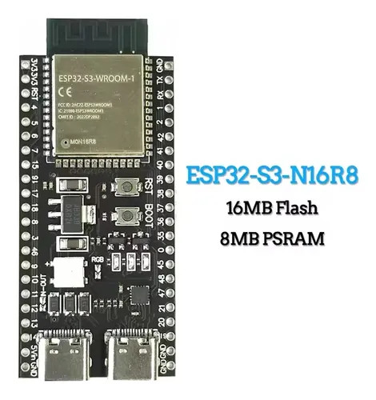
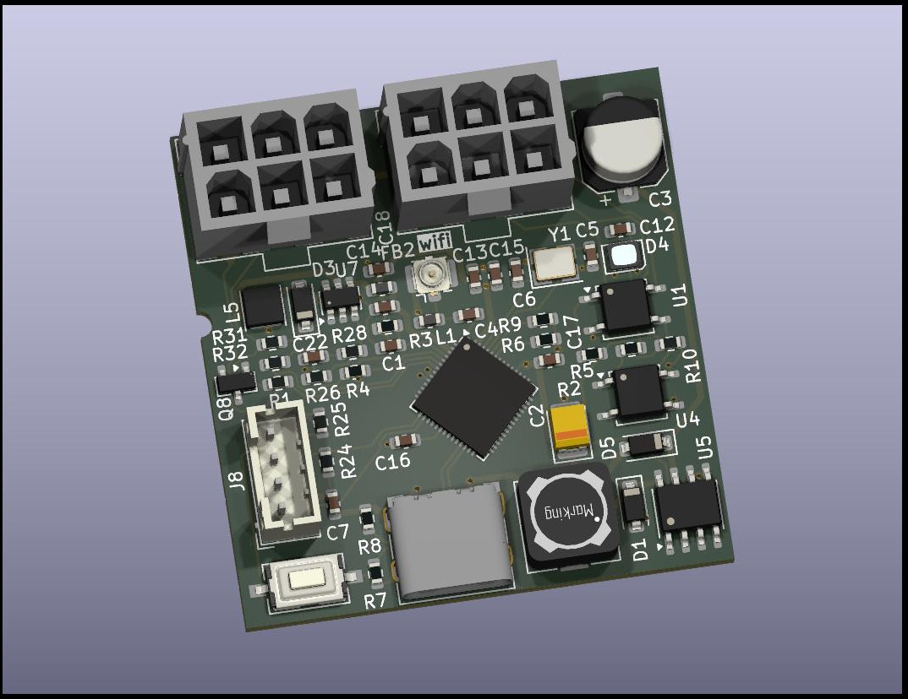

<div align="center">

[](https://discord.gg/YgnusQaDHM)
[](LICENSE)
[](https://docs.espressif.com/projects/esp-idf/)

# VMflow — MDB ESP32 Vending Machine Controller

**A micro vending machine controller (VMC) on the ESP32, speaking native MDB to real peripherals.**
</div>

---

This project implements the **MDB master / Vending Machine Controller (VMC)** side of the [Multi-Drop Bus](https://en.wikipedia.org/wiki/Multidrop_bus) protocol. The ESP32 acts as the brain of a micro vending machine: it powers the 9-bit MDB bus and polls real peripherals — coin changer, bill validator, and cashless readers — driving the full deposit → credit → vend → audit cycle. It runs on **any ESP32**, and ships with a bare-metal **KiCad** board that provides the sockets and level/current bridges required for MDB.

The board exposes **two independent MDB ports** — a **controller port** and a **target port** — so the same hardware can act as a VMC (this firmware, driving peripherals on the target port) or as an MDB peripheral on the controller port.



# Features
- **MDB master / VMC** firmware implementing the bus poll loop, ACK/NAK/RET handling, and 9-bit address/mode framing
- Talks to the standard MDB peripherals:
  - **Coin Changer** (moedeiro, address `0x08`) — setup, tube status, coin-type enable, deposited credit
  - **Bill Validator** (noteiro, address `0x30`) — setup, security, bill-type enable, escrow/stacker
  - **Cashless reader #1** (`0x10`) and **#2** (`0x60`) — reset/setup/poll/vend/reader session flow
- **Combined cash + cashless** vend logic: accumulates coin and bill credit, deducts on vend, and reports cash sales back to the cashless device for audit
- **EVA-DTS DEX** interface over a dedicated UART for reading machine audit data
- **WS2812 status LED** indicating MDB bus state
- Product-selection button (GPIO0) to trigger a vend on the selected coil
- **Dual MDB ports** (controller + target): drive peripherals as a VMC, or act as a peripheral on the controller port
- Bare-metal **KiCad** hardware: MDB sockets + bridges, designed for low-cost production and customization
- Part of the open **VMflow** platform — pairs with the [📊 Web Dashboard](https://vmflow.xyz/dashboard) for telemetry, sales, inventory, and AI-powered diagnostics

# Hardware

The companion board (KiCad project [`kicad/`](kicad)) carries the ESP32-S3 module and the MDB interface bridge (TX/RX opto-isolation and the 9-bit UART path) plus the peripheral socket. Shared on PCBWay:

👉 **[MDB ESP32 Bridge Device — PCBWay](https://www.pcbway.com/project/shareproject/MDB_ESP32_Bridge_Device_ca013cf8.html)**



[](https://www.pcbway.com/project/member/?bmbno=1B3B95CB-4E28-4D)

### MDB ports & pinout (default)

Two MDB ports — name reflects what you plug into each:

| Port            | RX  | TX  | Board role        | Used by                         |
|-----------------|-----|-----|-------------------|---------------------------------|
| **Target**      | IO4 | IO5 | acts as VMC       | this firmware (drives peripherals) |
| **Controller**  | IO1 | IO2 | acts as peripheral| connect to an external VMC      |

This VMC firmware uses the **target port** (peripherals plug in). The **controller port** lets an external vending machine drive the board.

Other pins:

| Signal        | GPIO | Note                         |
|---------------|------|------------------------------|
| MDB state LED | 48   | WS2812 status LED            |
| DEX RX        | 18   | EVA-DTS / DDCMP              |
| DEX TX        | 17   | EVA-DTS / DDCMP              |
| Vend button   | 0    | product select (active low)  |

MDB UART: 9600 baud, 9 data bits (8 data + 1 mode), even parity emulated for the 9th bit, 1 stop bit.

# Getting Started

Build with **ESP-IDF v5.x**:

```bash
# Clone the repository
git clone https://github.com/nodestark/mdb-esp32-vending-machine-control
cd mdb-esp32-vending-machine-control

idf.py build flash monitor
```

Wire the MDB bridge to the peripheral's MDB connector, power the bus, and the VMC starts polling automatically — reset → setup → enable → poll. Press the vend button to attempt a purchase using whichever credit (coin, bill, or cashless) is available.

# How to Contribute
- Contributions are welcome! Open issues, send pull requests, or propose new features
- Before submitting a pull request, make sure the code complies with the style and quality guidelines defined in the project
- Help improve documentation by adding usage examples, wiring notes, and peripheral compatibility reports

## License

This project is licensed under the MIT License - see the [LICENSE](LICENSE) file for details.
</content>
</invoke>
