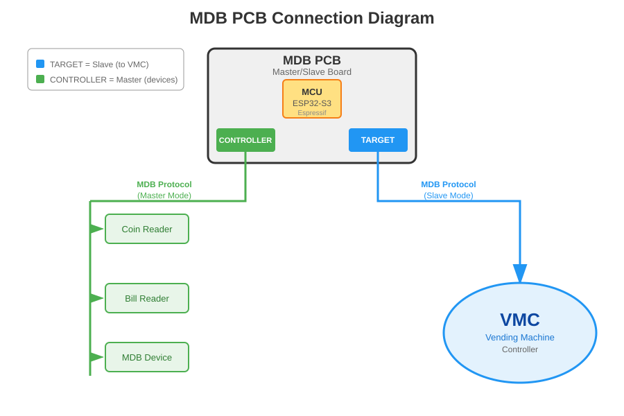

<div align="center">

[](https://discord.gg/YgnusQaDHM)
[](LICENSE)
[](https://docs.espressif.com/projects/esp-idf/)

# VMflow — MDB ESP32 Controller/Target Bridge

**A dual-port MDB bridge on the ESP32-S3, sitting between a vending machine's VMC and its peripherals.**
</div>

---

This project implements an **MDB bridge** between a vending machine's real VMC and its peripherals over the [Multi-Drop Bus](https://en.wikipedia.org/wiki/Multidrop_bus) protocol. The board exposes **two independent MDB ports**:

- **Controller port** — the board is the master: it drives the physical peripherals (coin changer `0x08` and bill validator `0x30`).
- **Target port** — the board is a slave: it emulates cashless (`0x10`), coin changer (`0x08`), and bill validator (`0x30`) toward the vending machine's real VMC.

The firmware bridges the two ports: coin/bill events detected on the controller port are relayed as MDB events on the target port (and enable/dispense/escrow commands the other way). Crucially, the target port **mirrors each physical peripheral's identity** to the VMC — its currency/country code, scale factor and decimal places — so the machine accepts them (a mismatched or unknown currency makes the VMC reject the device, e.g. `NOTE INCOMPAT`).

The cashless device (`0x10`) is **self-contained**: no physical cashless is bridged. Credit is granted out-of-band by the **VMflow payment engine** (BLE phone app) or the signed `credit` MQTT RPC, and each vend is approved locally against the session's available funds. Credit is bound to a single session — granted at Begin Session and destroyed at Session End/Reset — so no balance carries over or approves an out-of-session vend.


# Features
- **MDB controller↔target bridge**: bus poll loop, ACK/NAK/RET handling, 9-bit address/mode framing, on both an independent hardware-UART master port and a bit-banged slave port
- **Coin changer** (`0x08`) and **bill validator** (`0x30`) bridged as repeaters — the target port mirrors the real device's currency/country code, scale factor, decimal places, and tube/stacker counts, and forwards type-enable/dispense/escrow commands back to the physical device
- **Cashless** (`0x10`) **self-contained** on the target port — no physical cashless is bridged; credit is granted out-of-band and each vend is decided locally:
  - the **VMflow payment engine** — BLE (NimBLE) phone-app vend/session channel, HMAC-signed
  - the signed `credit` MQTT RPC command
  - credit is single-session (granted at Begin Session, destroyed at Session End/Reset); a vend is approved iff the item price fits the available funds
- **WiFi + MQTT** uplink (`mqtt.vmflow.xyz`) with signed remote-RPC commands (`info`, `safe`, `credit`, `oos`, `echo`, `restart`, `ota`) and telemetry (`vend_ok`, `vend_fail`, `sale`, `paxcounter`)
- **`info` RPC endpoint** reports firmware version, uptime and heap (plus a coin-vault snapshot)
- **`safe` RPC endpoint** reports cash currently in the machine: the **coin vault** (live tube count × per-coin credit — accurate) and the **bill vault** (value of bills stacked since boot; best-effort, since MDB never reports a bill's denomination once stacked), plus the raw bill stacker count
- **BLE passive-scan foot-traffic counter** ("paxcounter") — periodic scan classifying nearby phones by manufacturer ID/appearance, reported hourly
- **OTA** over HTTPS (`esp_https_ota`), triggered by the signed `ota` RPC command, pulling a release binary from this repo
- **WS2812 status LED** indicating provisioning/MQTT state
- Configurable via `idf.py menuconfig` → **VMflow** → MDB Cashless Device (currency/country code, scale factor, decimal places) — used as the fallback identity for any peripheral not (yet) online on the controller port
- Bare-metal **KiCad** hardware: MDB sockets + bridges, designed for low-cost production and customization
- Part of the open **VMflow** platform — pairs with the [📊 Web Dashboard](https://vmflow.xyz/dashboard) for telemetry, sales, inventory, and AI-powered diagnostics

# Hardware

The companion board (KiCad project [`kicad/`](kicad)) carries the ESP32-S3 module and the MDB interface bridge (TX/RX opto-isolation and the 9-bit UART path) plus the peripheral socket. Shared on PCBWay:

👉 **[MDB ESP32 Bridge Device — PCBWay](https://www.pcbway.com/project/shareproject/MDB_ESP32_Bridge_Device_ca013cf8.html)**


[](https://www.pcbway.com/project/member/?bmbno=1B3B95CB-4E28-4D)

### MDB ports & pinout (default)

Two MDB ports — name reflects the board's role on each:

| Port            | RX  | TX  | Board role          | Connects to                                  |
|-----------------|-----|-----|---------------------|----------------------------------------------|
| **Controller**  | IO1 | IO2 | master (VMC)        | peripherals: coin changer, bill validator            |
| **Target**      | IO4 | IO5 | slave (peripheral)  | the vending machine's VMC/master             |

Both ports are driven at once by this firmware: peripherals plug into the **controller port**, the vending machine's real VMC plugs into the **target port**, and the firmware bridges the two.

Other pins:

| Signal        | GPIO    | Note                                  |
|---------------|---------|----------------------------------------|
| MDB state LED | 48      | WS2812 status LED                      |
| I2C SDA       | 10      | reserved, not used by this firmware yet |
| I2C SCL       | 11      | reserved, not used by this firmware yet |

MDB UART: 9600 baud, 9 data bits (8 data + 1 mode), even parity emulated for the 9th bit, 1 stop bit.



# Getting Started

Build with **ESP-IDF v5.x**:

```bash
# Clone the repository
git clone https://github.com/nodestark/mdb-esp32-master
cd mdb-esp32-master

idf.py menuconfig   # VMflow -> MDB Cashless Device: currency/country code, scale, decimal
idf.py build flash monitor
```

Wire the peripherals (coin changer, bill validator) to the **controller port**, and the vending machine's real VMC to the **target port**. Both sides start polling automatically — reset → setup → enable → poll. Provision WiFi/subdomain/passkey and use the cashless session from the VMflow phone app over BLE, or grant credit remotely via the signed `credit` MQTT RPC command.

# How to Contribute
- Contributions are welcome! Open issues, send pull requests, or propose new features
- Before submitting a pull request, make sure the code complies with the style and quality guidelines defined in the project
- Help improve documentation by adding usage examples, wiring notes, and peripheral compatibility reports

## License

This project is licensed under the MIT License - see the [LICENSE](LICENSE) file for details.
